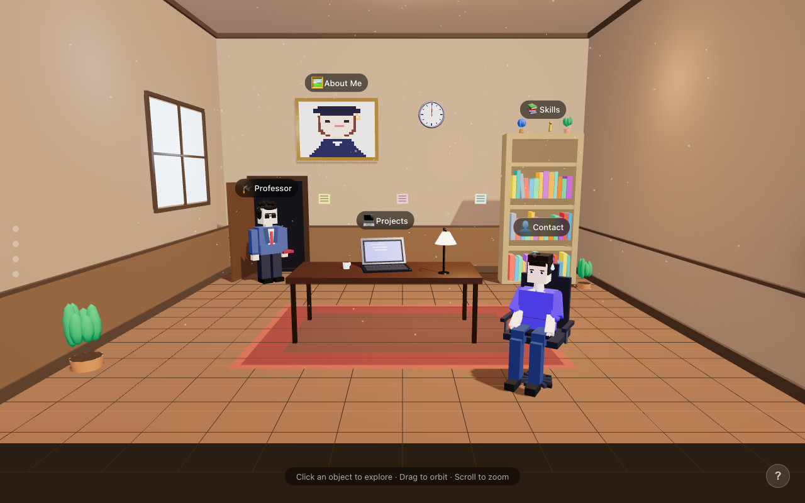
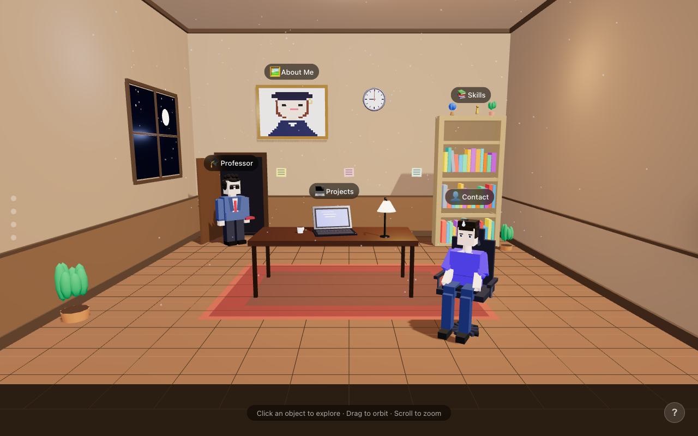

# 🖥️ My 3D Resume

An interactive 3D portfolio experience built with Three.js — explore a fully rendered room and discover my work, skills, and contact info by clicking on objects.

> **Live Demo:** [_My 3D Resume_](https://my-3d-resume-one.vercel.app/)

---

## Preview




---

## What It Is

Instead of a flat page, this portfolio renders a 3D room you can orbit, zoom, and interact with. Each object in the room is a portal to a section of my resume:

| Object | Section |
|---|---|
| 💻 Laptop | Projects |
| 📚 Bookshelf | Skills |
| 🖼️ Wall Frame | About Me |
| 🧑‍💻 Character | Contact |

The room lighting and wall painting also change based on the time of day — visit at night for a different look.

---

## Controls

| Action | Result |
|---|---|
| Click & drag | Orbit the camera |
| Scroll | Zoom in / out |
| Click an object | Fly to it and open detail panel |
| `ESC` | Close panel and reset view |
| Side dots | Jump to a specific object |

---

## Tech Stack

- **[Three.js](https://threejs.org/)** — 3D scene, geometry, materials, lighting, raycasting
- **[GSAP](https://gsap.com/)** — Smooth camera fly-to animations
- **[SvelteKit 2](https://kit.svelte.dev/)** — App framework, routing, SSR/prerendering, SEO
- **[Svelte 5](https://svelte.dev/)** — UI components with runes-based reactivity
- **TypeScript** — End-to-end type safety

---

## Project Structure

```
my-3d-resume/
├── src/
│   ├── lib/
│   │   ├── data/
│   │   │   └── resume.ts          # All portfolio content (single source of truth)
│   │   ├── scene/                 # Pure TS modules wrapping Three.js logic
│   │   │   ├── setup.ts           # Renderer, camera, controls
│   │   │   ├── lighting.ts        # Day/night lighting system
│   │   │   ├── clock.ts           # Simulated time of day
│   │   │   ├── interactions.ts    # Raycasting & click handling
│   │   │   ├── camera-anim.ts     # Fly-to camera animations
│   │   │   └── labels.ts          # Object labels
│   │   ├── stores/
│   │   │   ├── scene.svelte.ts    # Scene state (loading, focus, lamp, clock)
│   │   │   └── ui.svelte.ts       # Panel content, help modal, mobile notice
│   │   └── components/
│   │       ├── Scene.svelte       # Three.js canvas wrapper
│   │       └── UI/                # LoadingScreen, Panel, NavDots, HelpModal, etc.
│   └── routes/
│       ├── +layout.svelte         # SEO meta + JSON-LD schema
│       ├── +page.svelte           # Main 3D experience
│       ├── about/                 # Prerendered static fallback page
│       ├── projects/              # Prerendered static fallback page
│       └── contact/               # Prerendered static fallback page
├── svelte.config.js
├── vite.config.ts
└── package.json
```

---

## Customization

All personal content lives in **`src/lib/data/resume.ts`**. Edit it to make this your own:

```ts
export const resumeData = {
  about: {
    name: "Your Name",
    role: "Your Title",
    bio: "Your bio...",
    // ...
  },
  projects: [ /* your projects */ ],
  skills: { frontend: [], backend: [], tools: [] },
  contact: { email: "", github: "", linkedin: "" },
};
```

---

## Running Locally

```bash
npm install
npm run dev
```

Then open `http://localhost:5173`.

---

## Building for Production

```bash
npm run build
npm run preview   # preview the production build locally
```

---

## Deploying

- **Vercel** — push to GitHub and connect the repo; zero-config with `@sveltejs/adapter-auto`
- **Netlify** — same, connect repo and deploy
- **GitHub Pages** — switch to `@sveltejs/adapter-static` in `svelte.config.js`

---

## Performance Notes

- Three.js is lazy-loaded in `onMount` — zero SSR cost, excluded from the server bundle
- Shadows are disabled on mobile to maintain smooth frame rates
- Pixel ratio is capped on high-DPI displays
- All 3D geometry is generated in JavaScript — no external model files needed
- Static fallback pages (`/about`, `/projects`, `/contact`) are prerendered for SEO and no-WebGL scenarios

---

## License

MIT — feel free to fork, customize, and use as your own portfolio.
